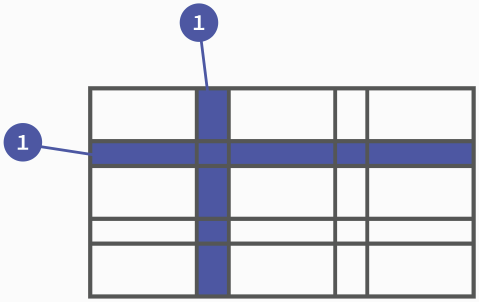

# Grid 布局

网格（Grid）布局将网页划分为一个个网格，可以任意组合不同的网格，做出各种各样的布局。

弹性（Flex）布局是轴线布局，只能指定”项目“针对轴线的位置，可以看作**一维布局**；Grid 布局将容器划分为行和列，产生单元格，然后指定”项目“所在的单元格，可以看作**二维布局**。

## 1. 基本概念

### 1.1 容器和项目

和 Flex 类似，采用网格布局的区域称为**容器**（container），容器内部采用网格定位的子元素称为**项目**（item）。

### 1.2 行、列、单元格

容器里的水平区域称为**行**（row），垂直区域称为**列**（column）。



行和列交叉区域称为**单元格**（cell）。正常情况下，`n`行和`m`列会产生`n x m`个单元格。

### 1.3 网格线

划分网格的线，称为**网格线**（grid line）。水平网格线划分出行，垂直网格线划分出列。

正常情况下，`n`行有`n + 1`根水平网格线，`m`列有`m + 1`根垂直网格线。


## 2. 容器属性

### 2.1 display

```css
display: grid; /* 块级网格（默认） */
display: inline-grid; /* 行内网格 */
```

设为网格布局后，容器子元素的`float`、`display: inline-block`、`display: table-cell`、`vertical-align`、`column-*`等设置都将失效。

### 2.2 grid-template-columns & grid-template-rows

`grid-template-columns`定义每列的列宽，`grid-template-rows`定义每行的行高。

```css
grid-template-rows: 100px 100px 100px;
grid-template-columns: 100px 100px 100px;
```

除了使用绝对单位，也可以使用百分比。

1. `repeat()`

   当要写连续的重复值时候可以使用`repeat(num, value)`函数。

   num：重复的次数；value：重复的值。

   ```css
   /* 重复一个值 */
   grid-template-rows: repeat(3, 100px);
   grid-template-columns: repeat(3, 100px);
   /* 重复一组值 */
   grid-template-rows: repeat(3, 100px 50px 200px);
   ```

2. `auto-fill`关键字

   有时，单元格的大小是固定的，但是容器的大小不确定。如果希望每一行（或每一列）容纳尽可能多的单元格，这时可以使用`auto-fill`关键字表示自动填充。

   ```css
   grid-template-columns: repeat(auto-fill, 100px);
   /* 表示每列宽 100px，自动填充，直至容器不能放置更多的列 */
   ```

3. `fr`关键字

   `fr`（片段`fraction`），这个值就像 Flex 布局的`flex-grow`属性。

   ```css
   grid-template-columns: 1fr 2fr;
   /* 表示第二列宽是第一列宽的两倍 */
   ```

   `fr`可以与绝对长度单位结合使用。

4. `minmax()`

   `minmax(min, max)`函数产生一个长度范围，表示长度就在`min ~ max`这个范围中。

   ```css
   grid-template-columns: 1fr 1fr minmax(100px, 1fr);
   ```

5. `auto`关键字

   `auto`关键字表示由浏览器自己决定长度。

   ```css
   grid-template-columns: 100px auto 100px;
   ```

6. 网格线的名称

   `grid-template-columns`属性和`grid-template-rows`属性里面，可以使用`[]`指定每一根网格线的名字，方便以后的引用。

   ```css
   grid-template-columns: [c1] 100px [c2] 100px [c3] auto [c4];
   grid-template-rows: [r1] 100px [r2] 100px [r3] auto [r4];
   ```

   网格布局允许同一根线有多个名字，比如`[fifth-line row-5]`。

### 2.3 grid-row-gap & grid-column-gap & grid-gap

`grid-row-gap`设置行间距，`grid-column-gap`设置列间距。

```css
grid-row-gap: 20px;
gird-column-gap: 20px;
```

`grid-gap`是上面两个属性的简写形式。

```css
grid-gap: <grid-row-gap> <grid-column-gap>;
```

如果省略了第二个值，浏览器认为第二个值等于第一个值。

### 2.4 grid-template-areas

网格布局允许指定"区域"（area），一个区域由单个或多个单元格组成。`grid-template-areas`属性用于定义区域。

```css
/* 划分出9个单位 */
grid-template-columns: 100px 100px 100px;
grid-template-rows: 100px 100px 100px;
/* 将其定名为a到i的九个区域 */
grid-template-areas: 'a b c'
                     'd e f'
                     'g h i';
```

多个单元格合并成一个区域：

```css
grid-template-areas: 'a a a'
                     'b b b'
                     'c c c';
```

某些区域不需要利用，则使用`.`表示。

### 2.5 grid-auto-flow

划分网格以后，容器的子元素会按照顺序，自动放置在每一个网格。默认的放置顺序是"先行后列"，即先填满第一行，再开始放入第二行。

```css
grid-auto-flow: row; /* (default)修改放置顺序为"先行后列" */
grid-auto-flow: column; /* 设置放置顺序为"先列后行" */
/* 尽可能紧密填满 */
grid-auto-flow: row dense;
grid-auto-flow: column dense;
```


