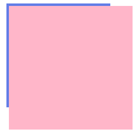

# Transform 让 absolute 的子元素隐藏

CSS 的 `transfrom` 属性真的让人又爱又恨，虽然功能挺不错，但有些情况下，还是常常对页面产生莫名其妙的影响。

来看下 HTML 结构：

```html
<div class="container">
  <div class="child"></div>
</div>
```

当容器设置了溢出隐藏，其子元素溢出容器的部分自然会被隐藏，但是当子元素设置了绝对定位，脱离了正常文本流，在正常文本流中的位置不再存在，容器的溢出隐藏对这个绝对定位的子元素就没有用了（当然，容器设置相对定位的情况另谈）。

```scss
.container {
  width: 200px;
  height: 200px;
  overflow: hidden; // 父元素隐藏
  border: blue;
  .child {
    width: 250px;
    height: 250px;
    background: pink;
    position: absolute; // 子元素绝对定位
  }
}
```

此时页面上渲染出来的效果是这样的：



当容器设置了`transform`属性，这个时候`overflow: hidden`对这个绝对定位的子元素就生效了。

```scss
.container {
  width: 200px;
  height: 200px;
  overflow: hidden;
  border: blue;
  transform: translate(0, 0);
  .child {
    width: 250px;
    height: 250px;
    background: pink;
    position: absolute;
  }
}
```

此时页面上，子元素溢出容器的部分就被隐藏了：


有人可能会想，设一设`z-index`就回去了吧？ 然而不能，无论子元素的层级设多高，都是一样的结果。

你以为就这样结束了吗？ 在支持`transform`属性的 IE 浏览器上会出问题！设置了`translate(0, 0)`的容器会认为是没设，只有当其值不为全0的时候，溢出隐藏才会生效。那怎么办？为了视觉上没差，我使用`translate3d(0, 0, 1px)`对垂直于屏幕的方向设置值，这样就不是全 0 的值了，IE 上的子元素又能继续隐藏了。


