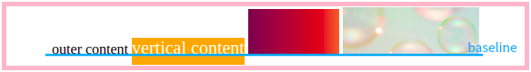

# vertical-align

> 有些时候 `vertical-align` 的渲染结果并不同我们想象的一样。
> 虽然现在已经有很多 CSS 属性可以完美替代 `vertical-align` 的渲染效果，但作为一个Front-End Programmer，怎么能不搞清楚它？

<font color="red">☆</font>**作用对象**：`inline`、`inline-block`子元素。

这个属性失效的情况：

1. 作用对象是块级元素（因为块级元素会霸占整行）；
2. 作用元素设置了浮动、定位等脱离文本流的属性（父元素设置这些属性不影响）；
3. 父元素是`flex`或`grid`布局（作用元素设置这些布局不影响）。

## 1. 属性值

可选参数：

|      值       |                             描述                             |
| :-------------: | :----------------------------------------------------------: |
|  `baseline`   |           (default) 元素放在父元素的基线上。           |
|     `top`     |           元素的顶端与行中最高元素的顶端对齐           |
|   `bottom`    |          把对齐的子元素的底端与 line box底端对齐。           |
|     `sub`     |            降低元素的基线到父元素合适的下标位置。            |
|    `super`    |            升高元素的基线到父元素合适的上标位置。            |
|   `middle`    |   元素的中垂点与父元素的基线加1/2父元素中字母的高度对齐。    |
|  `text-top`   |      把元素的顶端与父元素内容区域的顶端对齐(文字顶端)。      |
| `text-bottom` |           把元素的底端与父元素内容区域的底端对齐。           |
|   `inherit`   |              采用父元素相关属性的相同的指定值。              |
|     长度      |                   通过距离升高或降低元素。                   |
|       %       | 通过相对于`line-height`属性的百分值升高或降低元素。 |

看表格的描述太抽象，还不如来点儿实际的～

HTML 代码：

```html
<div class="container">
  Father Text
  <span class="content">
  	Child Text
  </span>
  
</div>
```

1. `baseline`：元素放在父元素的基线上。

   ```css
   .content, img {
     vertical-align: baseline;
   }
   ```

   实际上是图片底边、子元素文字底边和父元素行中文字底边对齐。

   

2. `top`：元素的顶端与行中最高元素的顶端对齐。

   ```css
   .content, img {
     vertical-align: top;
   }
   ```

   

3. **长度值**：

   正值升高元素，负值降低元素。0值等同于`baseline`。 

   ```scss
   .child {
     vertical-allign: -2px; // 元素相对于基线向下偏移2px
   }
   ```

4. **百分比**：

   这里百分比是相对于此标签继承的`line-height`值。

   ```scss
   .child {
     vertical-align: -10%;
   }
   ```

   假设`.child`元素继承的行高是`100px`，这里的`-2%`代表的实际值是`-10% × 20 = -2px`，所以是让元素下降 2 像素。

   > <font color="red">！</font>IE6 / 7 下的`vertical-align`百分比值不支持小数的`line-height`。

