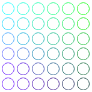
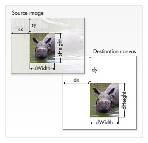

# Canvas

## 1.基本用法

```html
<canvas id="tutorial" width="150" height="150"></canvas>
```

`<canvas>`实际上只有两个属性——`width`和`height`，当没有设置宽高时，`canvas`会初始化宽 300px 高 150px。该元素可以使用 CSS 来定义大小，在绘制时图像会伸缩以适应框架尺寸，如果CSS的尺寸与初始画布的比例不一致，图像会出现扭曲。

> <font color=orange>Notice：</font>如果绘制出来的图像是扭曲的，试着用`width`和`height`属性为 canvas 明确规定宽高。

canvas 元素可以像任何普通图像一样（有`margin`、`border`等属性），这些样式不会影响在 canvas 中的实际图像。没有规定样式的 canvas 是完全透明的。

### 1.1 替换内容

canvas 可以设置替换内容。不支持 canvas 标签的浏览器将会忽略 canvas 容器并在其中渲染后备内容。

```html
<canvas id="clock" width="150" height="150">
  <!-- 不支持canvas的浏览器将会忽略外部canvas,只渲染img标签 -->
  
</canvas>
```

`</canvas>`结束标签不能省略，否则文档的其余部分会被认为是替代内容，不会显示出来。

### 1.2 渲染上下文

canvas 元素创造一个固定大小的画布，公开一个或多个**渲染上下文**，它可以用来绘制和处理要展示的内容。

canvas 开始是空白的。首先脚本要找到渲染上下文，然后在这上面绘制。

canvas 元素有一个`getContext()`方法，用来获取上下文和它的绘画功能。方法只有一个参数：上下文格式。

通过测试`getContext()`方法是否存在，可以检查浏览器对 canvas 的支持性。

```javascript
var canvas = document.getElementById('tutorial');
if (canvas.getContext) {
  var ctx = canvas.getContext('2d');
  // ...
} else {
  // ...
}
```

---

## 2.绘制形状

### 2.1 画布栅格

canvas 元素默认被网格覆盖，通常网格中的一个单元相当于 Canvas 中的 1 像素。栅格的起点为左上角(0, 0)，所有图像的位置都相对于原点定位。


### 2.2 绘制矩形

HTML 中的 Canvas 只支持一种原生的图形绘制：矩形。所有其他的图形绘制都需要至少生成一条路径。

Canvas 提供了 3 种方法绘制矩形：

1. `fillRect(x, y, width, height)`：绘制一个填充的矩形。
2. `strokeRect(x, y, width, height)`：绘制一个矩形的边框。
3. `clearRect(x, y, width, height)`：清除指定矩形区域，让清除部分完全透明。

`x`、`y`指定了在 Canvas 画布上所绘制的矩形相对于原点的坐标；`width`和`height`设置矩形尺寸。

### 2.3 绘制路径

#### 2.3.1 基本步骤

图形的基本元素是路径。路径是通过不同颜色和宽度的线段或曲线相连形成的不同形状的点的集合。一个路径，甚至一个子路径都是闭合的。使用路径绘制图形需要一些额外的步骤：

1. 创建路径起始点；
2. 使用画图命令去画出路径；
3. 把路径封闭；
4. 一旦路径生成，就能通过描边或填充路径区域来渲染图形。

要用到的函数：

- `beginPath()`：新建一条路径，生成之后，图形绘制命令被指向到路径上生成路径。
- `closePath()`：闭合路径后图形绘制命令又重新指向到上下文中。这个方法通过绘制一条从当前点到开始点的直线来闭合图形，如果图形已经是闭合的，即当前点为开始点，该函数什么也不做。
- `stroke()`：通过线条绘制图形轮廓。
- `fill()`：通过填充路径的内容区域生成实心的图形。

本质上，路径由很多子路径构成，这些子路径都是在一个列表中，所有子路径（线、弧形等）构成图形。每次这个方法调用后，列表清空重置，就可以重新绘制新的图形。

> <font color=orange>Notice：</font>
>
> 当前路径为空，即调用`beginPath()`后，或 canvas 刚建时，第一条路径构造命令通常被视为是`moveTo()`。因此，一般要在设置路径之后专门指定起始位置。
>
> 当调用`fill()`函数时，所有没有闭合的形状都会自动闭合，所以不需要调用`closePath()`函数；但调用`stroke()`时不会自动闭合。

#### 2.3.2 移动笔触 、线、圆弧、矩形

**移动笔触**

`moveTo(x, y)`：将笔触移动到指定的坐标上。

**线**

`lineTo(x, y)`：绘制一条从当前位置到指定坐标的直线。

```javascript
function draw() {
  var canvas = document.getElementById('canvas');
  if (canvas.getContext) {
    var ctx = canvas.getContext('2d');
    // 1.创建起始点
    ctx.beginPath();
    ctx.moveTo(100, 100); // 移动笔触设置起点
    // 2.用画图路径命令画出路径
    ctx.lineTo(150, 100);
    ctx.lineTo(100, 150);
    // 3.把路径封闭; 4.通过填充来渲染图形
    ctx.fill();    
  }
}
```

上面代码绘制结果：


**圆弧**

`arc(x, y, radius, startAngle, endAngle, anticlockwise)`：画一个以`(x, y)`为圆心，以`radius`为半径的圆弧，从`startAngle`开始到`endAngle`结束，按`anticlockwise`给定的方向（默认为顺时针）生成，它为`true`时是逆时针方向，否则为顺时针方向。

`arcTo(x1, y1, x2, y2, radius)`（不太可靠）：根据给定的控制点和半径画一段圆弧，再以直线连接两个控制点。

> <font color=orange>Notice：</font>`arc()`函数中表示角的单位是弧度，不是角度。角度与弧度的 JS 表达式：
>
> `弧度 = (Math.PI / 180) * 角度`。

```javascript
function draw() {
  var canvas = document.getElementById('canvas');
  if (canvas.getContext) {
    var ctx = canvas.getContext('2d');
    ctx.beginPath();
    ctx.arc(75, 75, 50, 0, Math.PI*2, true); // 绘制
    ctx.moveTo(85, 85); // 移动触笔
    ctx.arc(75, 85, 10, 0, Math.PI, false);
    ctx.moveTo(65, 65);
    ctx.arc(60,65,5,0,Math.PI*2,true);  // 左眼
    ctx.moveTo(95,65);
    ctx.arc(90,65,5,0,Math.PI*2,true);  // 右眼
    ctx.stroke();
  }
}
```

上面代码绘制结果：


**矩形**

除了直接在 canvas 上绘制矩形的三个额外方法，还有`rect()`方法，将一个矩形路径增加到当前路径上。

`rect(x, y, width, height)`：绘制一个左上角坐标为`(x, y)`，宽高为`width`和`height`的矩形。

当执行该方法时，`moveTo()`方法 自动设置坐标参数`(0, 0)`，也就是说，当前笔触自动重置回默认坐标。

#### 2.3.3 贝塞尔曲线

一般用来绘制复杂有规律的图形。

`quadraticCurveTo(cp1x, cp1y, x, y)`：绘制二次贝塞尔曲线，`(cp1x, cp1y)`为一个控制点，`(x, y)` 为结束点。

`bezierCurveTo(cp1x, cp1y, cp2x, cp2y, x, y)`：绘制三次贝塞尔曲线，`(cp1x, cp1y)`为控制点一，`(cp2x, cp2y)`为控制点二，`(x, y)`为结束点。

二次贝塞尔曲线有一个开始点（蓝色）、一个结束点（蓝色）以及一个控制点（红色）；而三次贝塞尔曲线有两个控制点。


```javascript
// 用多个二次赛贝尔曲线绘制对话气泡
function draw() {
 var canvas = document.getElementById('canvas');
 if (canvas.getContext) {
   var ctx = canvas.getContext('2d');
   ctx.beginPath();
   ctx.moveTo(75,25);
   ctx.quadraticCurveTo(25,25,25,62.5);
   ctx.quadraticCurveTo(25,100,50,100);
   ctx.quadraticCurveTo(50,120,30,125);
   ctx.quadraticCurveTo(60,120,65,100);
   ctx.quadraticCurveTo(125,100,125,62.5);
   ctx.quadraticCurveTo(125,25,75,25);
   ctx.stroke();
  }
}
// 用多个三次贝塞尔曲线绘制❤
function draw() {
  var canvas = document.getElementById('canvas');
  if (canvas.getContext){
    var ctx = canvas.getContext('2d');
    ctx.beginPath();
    ctx.moveTo(75,40);
    ctx.bezierCurveTo(75,37,70,25,50,25);
    ctx.bezierCurveTo(20,25,20,62.5,20,62.5);
    ctx.bezierCurveTo(20,80,40,102,75,120);
    ctx.bezierCurveTo(110,102,130,80,130,62.5);
    ctx.bezierCurveTo(130,62.5,130,25,100,25);
    ctx.bezierCurveTo(85,25,75,37,75,40);
    ctx.fill();
  }
}
```

      

#### 2.3.4 Path2D 对象

`Path2D`对象用来缓存或记录绘画命令，这样能快速地回顾路径。

`path2D()`会返回一个初始化的 Path2D 对象（可能将某个路径作为变量——创建一个它的副本，或将一个包含 SVG path 数据的字符串作为变量）。

```javascript
new Path2D(); // 空的Path对象
new Path2D(path); // 克隆Path对象
new path2D(d); // 从SVG建立Path对象
```

所有的路径方法都可以在 Path2D 中使用。

```javascript
// 创造一个实心圆，并存为Path2D对象
function draw() {
  var canvas = document.getElementById('canvas');
  if (canvas.getContext){
    var ctx = canvas.getContext('2d');
    var circle = new Path2D();
    circle.moveTo(125, 35);
    circle.arc(100, 35, 25, 0, 2 * Math.PI);
    ctx.fill(circle);
  }
}
```

Path2D API 添加了`addPath`作为为对象添加 Path 的方法。适用于从几个元素中来创建对象：

`Path2D.addPath(path [, transform])`。

**使用 SVG paths**

新的 Path2D API 可以使用 SVG path data 来初始化 canvas 上的路径，这样获取路径时就可以以 SVG 或 canvas 的方式来重用它们。

```javascript
var p = new Path2D('M10 10 h 80 v 80 h -80 Z');
/*这条路径先移动到点(M10 10)，再右移80个单位(h 80)，
  然后下移80个单位(v 80)，接着左移80个单位(h -80)，再回到起点处(Z) */
```

---

## 3.添加样式和颜色

### 3.1 Colors 

有两个属性可以给图形上色：

1. `fillStyle = color`：设置图形的填充颜色。
2. `strokeStyle = color`：设置图形轮廓的颜色。

`color`可以是表示 CSS 颜色值的字符串、渐变对象、图案对象。默认情况下，线条和填充颜色都是`#000000`。

> <font color=orange>Notice：</font>一旦设置了`strokeStyle`或`fillStyle`的值，这个新值就会成为新绘制的图形的默认值。如果要给每个图形上不同的颜色，需要重新设置`fillStyle`或`strokeStyle`的值。

```javascript
// fillStyle示例
function draw() {
  let ctx = document.getElementById('canvas').getContext('2d');
  for (let i=0; i<6; i++) {
    for (let j=0; j<6; j++) {
      ctx.fillStyle = `rgb(255, ${Math.floor(255-42.5*i)}, ${Math.floor(255-42.5*j)})`;
      ctx.fillRect(j*25, i*25, 25, 25);
    }
  }
}
// strokeStyle示例
function draw() {
  var ctx = document.getElementById('canvas').getContext('2d');
  for (var i=0;i<6;i++){
    for (var j=0;j<6;j++){
      ctx.strokeStyle = `rgb(0, ${Math.floor(255-42.5*i)}, ${Math.floor(255-42.5*j)})`;
      ctx.beginPath();
      ctx.arc(12.5+j*25,12.5+i*25,10,0,Math.PI*2,true);
      ctx.stroke();
    }
  }
}
```

渲染出的结果：

       

### 3.2 Transparency

通过设置`globalAlpha`属性或使用一个半透明颜色作为轮廓或填充的样式：

`globalAlpha = transparencyValue`

这个属性影响到 Canvas 里所有图形的透明度，有效值的范围是 0.0 (完全透明) ～ 1.0 (完全不透明)，默认是 1.0。

由于`strokeStyle`和`fillStyle`属性接受符合 CSS3 规范的颜色值，就意味着可以通过`rgba()`方法来设置颜色的透明度。

### 3.3 Line styles

可以通过一系列属性来设置线的样式：

1. `lineWidth = value`：设置线条宽。
2. `lineCap = type`：设置线条末端样式。
3. `lineJoin = type`：设定线条与线条间接合处的样式。
4. `miterLimit = value`：限制当两条线相交时交界处最大长度。交接处长度（斜线长度）指线条交接处内角顶点到外角顶点的长度。
5. `getLineDash()`：返回一个包含当前虚线样式，长度为非负偶数的数组。
6. `setLineDash(segments)`：设置当前虚线样式。
7. `lineDashOffset = value`：设置虚线样式的起始偏移量。

**理解线条是怎么画出来的：**

是以线条的中间轴作为线条的路径，沿着路径向两边各延伸`lineWidth/2`。当线条两端的端点不是整数像素值，剩下距离整像素的区域，会以实际笔触颜色一半色调的颜色来填充整个区域。


> <font color=orange>Notice：</font>不止X轴，Y轴也同样会出现半渲染的像素点。
>
> 不过这种行为的表现取决于当前的 lineCap 风格，它默认为 butt；可以通过将 lineCap 样式设置为 square 正方形，来得到与技术宽度线的半像素坐标一致的笔画，这样，端点轮廓的外边框将被自动扩展，来完全覆盖整个像素格。
>
> 只有路径的起点和终点受此影响：如果一个路径是通过`closePath()` 来封闭的，它是没有起点和终点的；相反的情况下，路径上的所有端点都与上一个点相连，下一段路径使用当前的 lineJoin 设置（默认为 miter），如果相连路径是水平和/或垂直，会导致相连路径的外轮廓根据相交点自动延伸，因此渲染出的路径轮廓会覆盖整个像素格。

#### 3.3.1 lineCap

`lineCap`属性的值决定了线段端点显示的样子，可能的值：

- `butt`（默认）：端点直切。
- `round`：端点为圆。
- `square`：端点为正方形。


#### 3.3.2 lineJoin

`lineJoin`属性值决定了图形中两线段连接处所显示的样子，可能的值有：

- `round`：圆滑连接。
- `bevel`：平切连接。
- `miter`（默认）：切线连接。


**milterLimit 属性**

`miter`线段直接夹角较大的，交点不会太远，但当夹角减少时，交点距离会呈指数级增大。

`milterLimit`属性是用来设定外延交点与连接点的最大距离，如果交点大于这个值，连接效果会变成`bevel`。

### 3.3 使用虚线

用`setLineDash()`和`lineDashOffset`属性来指定虚线样式。

- `setLineDash()`方法接受一个数组来指定线段用于间隙的交替；
- `lineDashOffset`属性设置起始偏移量。

```javascript
let ctx = document.getElementById('canvas').getContext('2d');
let offset = 0;
function draw() {
  ctx.clearRect(0, 0, canvas.width, canvas.height);
  ctx.setLineDash([4, 2]); // 线段长4px 间隙长2px
  ctx.lineDashOffset = -offset; // 设置偏移量
  ctx.strokeRect(10, 10, 100, 100); // 绘制正方形
}
function march() {
  offset++;
  offset > 16 && (offset = 0);
  draw();
  setTimeout(march, 50); // 每50ms执行一次偏移
}
march();
```

### 3.4 渐变 Gradients

用线性或径向渐变来填充或描边。新建`canvasGradient`对象的方法：

- `createLinearGradient(x1, y1, x2, y2)`： 接受4个参数，表示渐变的起点`(x1, y1)`和终点`(x2, y2)`。
- `createLinearGradient(x1, y1, r1, x2, y2, r2)`：接受6个参数，前三个定义一个原点=`(x1, y1)`，半径=`r1`的圆；后三个参数则定义另一个原点=`(x2, y2)`，半径=`r2`的圆。

`strokeStyle`和`fillStyle`属性都可以接受`canvasGradient`对象。

创建出`canvasGradient`对象后，可以用`addColorsStop()`方法上色。

`gradient.addColorStop(position, color)`：方法接受2个参数，`position`必须是一个 0.0 与 1.0 之间的数值，表示渐变中颜色所在的相对位置（0.5 表示颜色会出现在正中间）；`color`必须是一个有效的 CSS 颜色值。

可以根据需要添加任意多个色标（color stops）。色标的定义是无所谓顺序的，但色标位置重复时，顺序就变得很重要。

```javascript
function draw() {
  let ctx = document.getElementById('canvas').getContext('2d');
  // blue sky & green land
  let lingrad1 = ctx.createLinearGradient(0, 0, 0, 150);
  lingrad1.addColorStop(0, '#00ABEB');
  lingrad1.addColorStop(.5, '#FFF');
  lingrad1.addColorStop(.5, '#26C000'); // 色标的位置重复时，顺序很重要
  lingrad1.addColorStop(1, '#FFF');
  ctx.fillStyle = lingrad1;
  ctx.fillRect(0, 0, 150, 150);
  // black pole
  let lingrad2 = ctx.createLinearGradient(0, 50, 0, 95);
  lingrad2.addColorStop(0, '#000');
  lingrad2.addColorStop(1, 'rgba(0, 0, 0, 0)');
  ctx.strokeStyle = lingrad2;
  ctx.strokeRect(50, 50, 50, 50);
  // sunshine
  let radgrad1 = ctx.createRadialGradient(125, 25, 10, 125, 25, 25);
  radgrad1.addColorStop(0, '#ffdf26');
  radgrad1.addColorStop(1, 'rgba(255, 255, 255, 0)');
  ctx.fillStyle = radgrad1;
  ctx.fillRect(100, 0, 50, 50);
  // ball
  let radgrad2 = ctx.createRadialGradient(33, 96, 2, 30, 100, 10);
  radgrad2.addColorStop(0, '#EEE');
  radgrad2.addColorStop(.8, '#444');
  radgrad2.addColorStop(1, 'rgba(255, 255, 255, 0)');
  ctx.fillStyle = radgrad2;
  ctx.fillRect(20, 90, 20, 20);
}
```

### 3.5 图案样式 Patterns

`createPattern(image, type)`：该方法接受两个参数。`image`可以是一个 Image 对象的引用，或另一个 canvas 对象；`Type`必须是下面的字符串值之一：`repeat`、`repeat-x`、`repeat-y`、`no-repeat`。

图案的应用和渐变类似，创建出一个 pattern 后，赋给`fillStyle`或`strokeStyle`属性即可。

> <font color=orange>Notice：</font>在 Firefox 1.5(Gecko 1.8) 中用 canvas 对象作为`image`参数是无效的。
>
> 与 drawImage 不同，需要确认 image 对象已经装载完毕，否则图案可能效果是不对的。

```javascript
function draw() {
  let ctx = document.getElementById('canvas').getContext('2d');
  // 创建新image对象用作图案
  let img = new Image();
  img.src = 'https://mdn.mozillademos.org/files/222/Canvas_createpattern.png';
  // 用img对象的onload来确保设置图案前图像已装载完毕
  img.onload = function() {
    let ptn = ctx.createPattern(img, 'repeat');
    ctx.fillStyle = ptn;
    ctx.fillRect(0, 0, 150, 150);
  }
}
```

### 3.6 阴影 Shadows

- `shadowOffsetX = float`：`shadowOffsetX`设定阴影在 X 和 Y 轴的延伸距离，不受变换矩阵所影响，负值表示阴影会往左延伸，正值则表示会往右延伸，默认为0。
-  `shadowOffsetY = float`：`shadowOffsetY`设定阴影在 Y 轴的延伸距离，不受变换矩阵所影响，负值表示阴影会往上延伸，正值表示会往右延伸，默认为0。

### 3.7 Canvas 填充规则

当用到`fill` / `clip` / `isPointinPath`可以选择一个填充规则，该填充规则根据某处在路径外或里来决定该处是否被填充，这对于与本路径相交或路径被嵌套的时候是有用的。

两个可能的值：`"nonzero"`（默认，非零绕组规则）、`"evenodd"`（奇偶规则）。

```javascript
function draw() {
  var ctx = document.getELementById('canvas').getContext('2d');
  ctx.beginPath();
  ctx.arc(50, 50, 30, 0, Math.PI*2, true);
  ctx.arc(50, 50, 15, 0, Math.PI*2, true);
  ctx.fill("evenodd");
}
```

---

## 4.绘制文本

### 4.1 绘制文本

Canvas 提供了2种方法来渲染文本：

- `fillText(text, x, y [, maxWidth])`：在指定的`(x, y)`位置填充指定的文本，绘制的最大宽度是可选的。
- `strokeText(text, x, y, [, maxWidth])`：在指定的`(x, y)`位置绘制文本边框（就是空心文字），绘制的最大宽度是可选的。

当正常渲染的文字宽度 > 设置的绘制最大宽度，文字会被压缩。

```javascript
function draw() {
  var ctx = document.getElementById('canvas').getContext('2d');
  ctx.font = "48px serif";
  ctx.fillText("Hello world", 10, 50);
}
```

### 4.2 有样式的文本

可以改变 Canvas 显示文本的方式：

- `font = value`：当前用来绘制文本的样式。这个字符串使用和 CSS `font`属性相同的语法。默认的字体是`10px sans-serif`。
- `textAlign = value `：文本对齐选项。可选的值包括：
  - `start`（默认）：文本对齐线开始的地方。
  - `end`：文本对齐界线结束的地方。
  - `left`：文本左对齐。
  - `right`：右对齐。
  - `center`：居中对齐。
- `textBaseline = value`：基线对齐选项。可能的值包括：
  - `top`：文本基线在文本快顶部；
  - `hanging`：文本基线是悬挂基线；
  - `middle`：文本基线在文本块中间；
  - `alphabetic`：文本基线是标准的字母基线；
  - `ideographic`（默认）：文本基线是表意字基线，如果字符本身超出`ideographic`基线，那么`ideograhpic`基线位置在字符本身的底部；
  - `bototm`：文本基线在文本块的底部，与`ideograhpic`基线不需要考虑下行字母。
- `direction = value`：文本方向。可能的值包括：
  - `ltr`：文本方向从左向右。
  - `trl`：文本方向从右向左。
  - `inherit`（默认）：根据情况继承 Canvas 元素或 Document。

```javascript
function draw() {
  let ctx = document.getElementById('canvas').getContext('2d');
  ctx.font = '48px serif';
  // ctx.textBaseline = 'hanging';
  ctx.fillText('Hello world', 10, 50);
}
```

### 4.3 预测量文本宽度

当需要获得更多的文本细节时，`measureText()`可以提供测量文本，它返回一个`TextMetrics`对象的宽度、所在像素，这些体现文本特性的属性。

```javascript
function draw() {
  var ctx = docuemnt.getElementById('canvas').getContext('2d');
  var text = ctx.measureText('foo'); // TextMetrics object
  text.width;
}
```

---

## 5.使用图像

引入图像到 Canvas 需要两步基本操作：

1. 获得一个指向`HTMLImageElement`的对象或另一个 Canvas 元素的引用作为源，也可以通过提供一个 URL 的方式来使用图片。
2. 使用`drawImage()`函数将图片绘制到画布上。

### 5.1 获取需要绘制的图片

Canvas 图片源的类型：

- `HTMLImageElement`：这些图片是由`Image()`函数或``元素构造出来的。
- `HTMLVideoElement`：用一个`<video>`元素作为图片源，可以从视频中抓取当前帧作为一个图像。
- `HTMLCanvasElement`：可以使用另一个 Canvas 元素作为图片源。
- `ImageBitmap`：这是一个高性能的位图，可以低延迟地绘制，它可以从上述所有源以及其他集中源中生成。

这些源统一由`CanvasImageSource`类型来引用。

有几种方式可以获取到需要在 Canvas 上使用的图片。

1. **使用相同页面内的图片**

   通过以下方法中的一种获得与 Canvas 相同页面内图片的引用：

   - `document.images`集合；
   - `document.getElementsByTagName()`方法；
   - 如果知道想使用的指定图片的 ID，可以用`document.getElementById()`获得这个图片。

2. **使用其他域名下的图片**

   在`HTMLImageElement`上使用 crossOrigin 属性，可以请求加载其他域名上的图片。如果图片的服务器允许跨域访问这个图片，那么就可以使用这个图片而不污染 Canvas，否则使用这个图片将会污染 Canvas。

3. **使用其他 Canvas 元素**

   用`document.getElementsByTagName`或`document.getElementById`方法来获取其他 Canvas 元素。

   一个常用的应用就是将第二个 Canvas 作为另一个大的 Canvas 的缩略图。

4. **由零开始创建图像**

   用脚本创建一个新的`HTMLImageElement`对象。使用`Image()`构造函数比较方便。

   当脚本执行后，图片开始装载。

   ```javascript
   var img = new Image(); // 创建一个img元素
   // 若调用drawImage时图片没装载完，什么都不会发生
   // 一些浏览器可能会抛出异常
   // 因此应该用load事件保证不会在加载完毕前使用这个图片
   img.onload = function() {
     // 执行drawImage语句
   }
   img.src = 'myImage.png';
   ```

5. **通过 data: url 方式嵌入图像**

   Data urls 允许使用一串 Base64 编码的字符串的方式来定义一个图片。

   ```javascript
   img.src = 'data:image/gift;base64,R0lGODlhCwALAIAAAAAA3pn/ZiH5BAEAAAEALAAAAAALAAsAAAIUhA+hkcuO4lmNVindo7qyrIXiGBYAOw==';
   ```

   优点：① 图片内容即时可用，无须再到服务器兜一圈；② 可以将 CSS、JavaScript、HTML 和 图片全部封装在一起，迁移起来十分方便。

   缺点：图像没法缓存，图片大的话内嵌的 url 数据会很长。

6. **使用视频帧**

   还可以使用`video`中的视频帧（即便视频是不可见的）。

   ```javascript
   function getMyVideo() {
     var canvas =  document.getElementById('canvas');
     if (canvas.getContext) {
       var ctx = canvas.getContext('2d');
       return document.getElementById('myvideo');
     }
   }
   // 它将为这个视频返回HTMLVideoElement对象，它可以作为Canvas图片源
   ```

### 5.2 drawImage()

一旦获得了源图对象，就可以使用`drawImage()`将它渲染到 Canvas 里。`drawImage()`有三种形态。

#### 5.2.1 绘制图片

`drawImage()`的第一种形态：

`drawImage(image, x, y)`：`image`是 image 或 Canvas 对象；`(x, y)`是其在 Canvas 里的起始坐标。

> SVG 图像必须在`<svg>`根指定元素的宽度和高度。

#### 5.2.2 缩放

`drawImage()`方法第二种形态：

`drawImage(image, x, y, width, height)`：`width`和`height`用来控制当向 Canvas 画入时应该缩放的大小。

> <font color=orange>Notice：</font>图像可能会因为大幅度的缩放而变得起杂点或模糊。如果图像里有文字，最好不要进行缩放，否则那样处理后可能图像里的文字会变得无法辨认。

#### 5.2.3 切片

`drawImage()`方法第三种形态：

`drawImage(image, sx, sy, sWidth, sHeight, dx, dy, dWidth, dHeight)`：`(sx, sy)`图片切片位置；`sWidth`和`sHeight`是图片切片宽高；`(dx, dy)`切片目标显示位置；`dWidth`和`dHeight`是切片目标显示宽高。



### 5.4 控制图像的缩放行为

Gecko 1.9.2 引入了`mozImageSmoothingEnable`属性，值为`false`时，图像不会平滑地缩放。默认是`true`。

---


