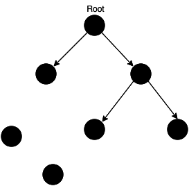

# 内存管理

JS 在创建变量时自动进行了内存分配，并在不使用它们时“自动”释放内存。
释放的过程称为“垃圾回收”。

# 一、内存生命周期

不管什么语言，内存生命周期基本是一致的：

1. 分配需要的内存；
2. 使用分配到的内存（读、写）；
3. 不需要时将其释放。

所有语言第二部分都是明确的，第一和第三部分在底层语言中是明确的，但在像JS这些高级语言中，大部分是隐含的。

### JS 的内存分配

**值的初始化**
JS在定义变量时就完成了内存分配。

**通过函数调用分配内存**
有些函数调用结果是分配对象内存：

```javascript
var d = new Data(); // 分配Date对象
var e =  document.createElement('div'); // 分配一个DOM元素
```

有些方法分配新变量或者新对象：

```javascript
var s = 'azerty';
var s2 = s.substr(0, 3);
// 因为字符串是不变量，JS可能决定不分配内存，只是存储了[0-3]的范围
var a = ["ouais ouais", "nan nan"];
var a2 = ["generation", "nan nan"];
var a3 = a.concat(a2);
// 新数组有4个元素，是a连接a2的结果
```

### 使用值

使用值的过程实际上是对分配内存进行读取与写入的操作。读取与写入可能是写入一个变量或者一个对象的属性值，甚至传递函数的参数。

### 当内存不再需要使用时释放

大多数内存管理的问题都在这个阶段。在这里，最艰难的任务是找到“哪些被分配的内存确实已经不在需要”。它往往要求开发人员来确定在程序中哪一块不再需要并释放它。

高级语言解析器嵌入了“垃圾回收器”，它的主要工作是跟踪内存的分配和使用，以便当分配的内存不再使用时，自动释放它。这是一个近似的过程，因为要知道是否仍然需要某块内存是无法通过某种算法解决的。

不再用到的内存没有及时释放，就叫做**内存泄漏**（Memery leak）。

## 二、垃圾回收

自动寻找一些内存是否不再需要的问题是无法判定的，因此垃圾回收机制只能有限地解决一般问题。

以下是垃圾回收的算法。

### 1. 引用计数 垃圾收集

一个对象有访问另一个对象的权限，叫做一个对象**引用**另一个对象。
在这里，“对象”的概念不仅特指 JS 对象，还包括函数作用域（或全局词法作用域）。

**引用计数**是最初级的垃圾收集算法。这个算法把“对象是否不再需要”简化定义为“对象有没有被其他对象引用”，如果引用数为0，对象将被垃圾回收机制回收。



如果一个值不再需要了，引用数却不为 0，垃圾回收机制无法释放这块内存，从而导致内存泄漏。

```javascript
const arr = [1, 2, 3, 4];
// 数组[1, 2, 3, 4]是一个值,会占用内存
// 变量arr是仅有的对这个值的引用，因此引用次数为1
// 尽管后面的代码没有用到arr,它还是会持续占用内存
```

**局限性：**无法处理循环引用的事例。

```javascript
function f() {
  var o = {},
      o2 = {};
  o.a = o2;
  o2.a = o;
  return 'azerty';
}
f();
```

IE 6、7使用引用计数方式对DOM对象进行垃圾回收，该方式常常造成对象被循环引用时发生泄漏。

### 2. 标记-清除

这个算法把“对象是否不再需要”简化定义为“对象是否可以获得”。

算法假定设置一个`root`对象（JS中，根是全局对象）。垃圾回收期将定期从根开始，找所有从`root`开始引用的对象，然后找这些对象引用的对象……从`root`开始，垃圾回收器将找到所有可以获得的对象和收集所有不能获得的对象。

这个算法比第一个好，因为”有0引用的对象“总是不可获得的，但相反却不一定。

从12年起，所有现代浏览器都使用了标记-清除垃圾回收算法。所有对 JS垃圾回收算法的改进都是基于标记-清除算法的改进，并没有改进算法本身和它对”对象是否不再需要“的简化定义。

**局限性：**无法从根对象查询到的对象都将被清除。