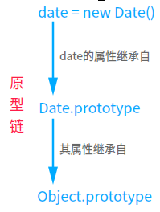

# 原型 & 类

> JS 中，万物皆对象！

## 1. 原型

这里有几个概念需要知道：

- **原型**：原型是 JS 中继承的基础，JS 的继承就是基于原型的继承。每个 JS 对象（`null`除外）都从原型继承属性。

- **原型对象**：所有通过对象直接量创建的对象都有一个原型对象，通过`对象.prototype`可以获得对原型对象的引用。通过关键字`new`和构造函数调用创建的对象的原型就是构造函数的 prototype 属性的值。

  通过`new Object()`和`{}`直接创建的对象，都继承自`Object.prototype`；同理通过`new Array()`创建的对象的原型就是`Array.prototype`。

- **原型链：**一个原型对象继承自另一个原型对象，一系列形成的链就是原型链。

  

- 

`Object`是为数不多的没有原型的对象之一。它不继承任何属性，其他原型对象都是普通对象，普通对象都具有原型。

在 JS 中声明一个函数 A，浏览器就会在内存中创建一个对象 B，而且每个函数都默认会有一个属性`prototype`指向这个对象

- **构造函数**：

每个**函数对象**都有一个`prototype`属性，这个属性指向函数的**原型对象**。