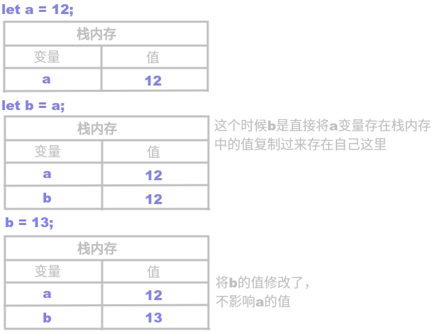

# 栈内存 & 堆内存

## 内存的概念

- **栈内存** Stack（可以理解为运行内存，如内存条）：
  所谓栈内存，其实就是在计算机内存中分配出来的一块空间。
  用于提供浏览器执行代码的执行环境，以及存储基本类型值。
- **堆内存** Heap （可以理解为存储空间，如硬盘）：
  用于存储引用类型值。

## 基本数据类型

**基本数据类型有哪些？**
JS 的基本数据类型有：数字、字符串、布尔值、`null`、`undefined`、`symbol`（ES6新增）。也就是除了对象（引用数据类型）外都是基本数据类型。

**基本数据类型执行过程：**

1. 创建一个值（基本类型值直接存在栈内存中）；
2. 创建一个变量，将其存储到VO（全局执行上下文中的全局变量对象）中；
3. 让2中创建的变量和1中创建的值关联在一起（赋值操作）。

明确这三个步骤的顺序，不可颠倒。


示例：

```javascript
let a = 12;
let b = a;
b = 123;
console.log(a); // => 12
```

分析：




## 引用数据类型

**引用数据类型有哪些？**
所有对象都是引用数据类型，包括函数、数组这些特殊的对象。


