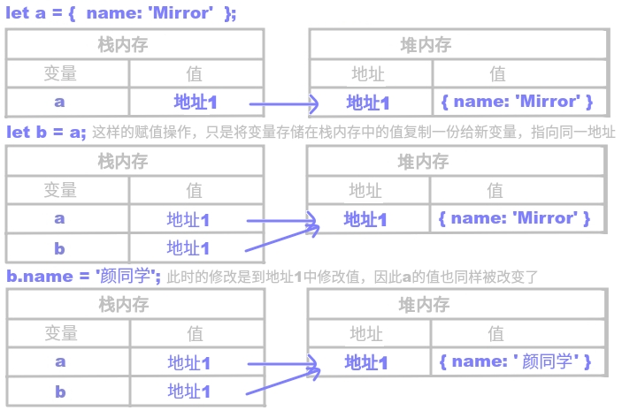

# 栈内存 & 堆内存

## 内存的概念

- **栈内存** Stack（可以理解为运行内存，如内存条）：
  所谓栈内存，其实就是在计算机内存中分配出来的一块空间。
  用于提供浏览器执行代码的执行环境，以及存储基本类型值。
- **堆内存** Heap （可以理解为存储空间，如硬盘）：
  用于存储引用类型值。

## 基本数据类型

**基本数据类型有哪些？**
JS 的基本数据类型有：数字、字符串、布尔值、`null`、`undefined`、`symbol`（ES6新增）。也就是除了对象（引用数据类型）外都是基本数据类型。

**基本数据类型执行过程：**

1. 创建一个值（基本类型值直接存在栈内存中）；
2. 创建一个变量，将其存储到VO（全局执行上下文中的全局变量对象）中；
3. 让2中创建的变量和1中创建的值关联在一起（赋值操作）。

明确这三个步骤的顺序，不可颠倒。


示例：

```javascript
let a = 12;
let b = a;
b = 123;
console.log(a); // => 12
```

分析：


## 引用数据类型

**引用数据类型有哪些？**
所有对象都是引用数据类型，包括函数、数组这些特殊的对象。

**引用数据类型值存在哪里？**
引用数据类型值都存在堆内存中。
由于引用数据类型的结构相对复杂，所以不能直接存储在栈内存中，需要单独开辟空间来存储，这个空间就是“堆内存“。

**引用数据类型中对象的执行过程：**

1. 创建值
   - 开辟一个堆内存，每个堆内存都有一个16进制地址
   - 把对象中的键值对分别存储到对内存中
   - 把对内存的地址放在栈内存中，用来供变量的引用
2. 创建一个变量（栈内存中）
3. 让变量和之前创建堆内存的地址进行关联。

示例：

```javascript
let a = {
  name: 'Mirror'
};
let b = a;
b.name = '颜同学';
console.log(a); //=> { name: '颜瑟' }
```

分析：



## 总结

由于浏览器对基本数据类型和引用数据类型的存储方式不同，因此出现了深浅拷贝的问题。
对于引用数据类型，默认的赋值操作是浅拷贝。

- 基本数据类型是按值操作，值存储在栈内存中。
  引用数据类型是按堆内存地址操作，值存储在堆内存中。
- 栈内存的作用是：提供浏览器执行代码的执行环境，以及存储基本类型值。
  堆内存的作用是：存储引用类型值。