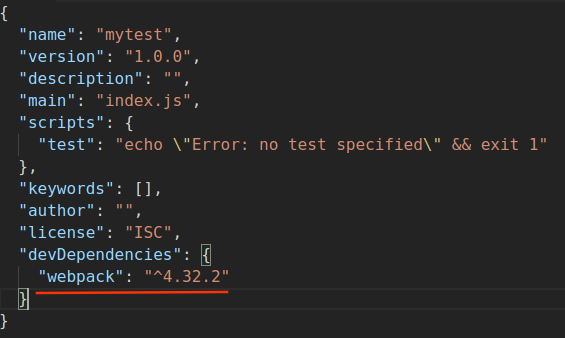

# webpack安装

> 由于 webpack 执行打包压缩时依赖 nodeJS，所以在安装 webpack 之前先安装一下 nodeJS。
>
> 因为 npm 是 nodeJS 平台默认的包管理工具，这里用 npm 安装 webpack。
>
> 本文默认已安装好 nodeJS 和 npm。

1. 首先，用 npm 在项目的根目录创建一个`package.json`文件：

   ```shell
   # 从当前目录中提取的信息生成默认的package.json
   npm init -y
   # 或
   npm init --yes
   ```

   出现一串文本表示执行成功：

   

2. 在项目中安装 webpack：

   ```shell
   # --save-dev: 安装到项目的依赖中
   npm install --save-dev webpack
   # 或 -g: 全局安装
   npm install -g webpack
   ```

   建议用`--save-dev`的方式，因为不是所有项目都需要 webpack。

3. 安装成功后，打开`package.json`文件查看 webpack 是否已经安装，并且查看 webpack 安装的版本。

   

   > 由于 webpack 4.x 以上将命令相关的内容都放到了 webpack-cli，所以还需要安装 webpack-cli。

4. 安装 webpack-cli。

   ```shell
   npm install --save-dev webpack-cli
   ```

   在`package.json`文件中，`devDependencies`中能够看到`webpack-cli`的版本信息。

5. 验证成功

   ```shell
   # 查看webpack版本
   node_modules/.bin/webpack -v
   # 查看webpack-cli版本
   node_modules/.bin/webpack-cli -v
   ```

   因为是局部安装，因此 webpack 是在依赖包里的，对于它们命令的执行，要进入依赖包才行，否则是被认为命令无效的。