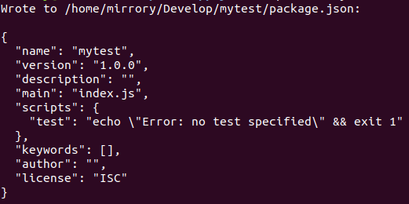

# webpack

> 安装Webpack前需要做的准备工作：
>
> 1. 由于 webpack 执行打包压缩时依赖 nodeJS，先确保你的系统安装了nodeJS `5.0.0` 及以上的版本。
> 2. 因为 npm 是 nodeJS 平台默认的包管理工具，这里用 npm 安装 webpack。

Webpack有两种安装方式：
**全局安装**：安装Webpack到全局后，可以在任何地方共用一个Webpack可执行文件，而不用各个项目重复安装。
**局部安装**：（推荐）安装到某个项目中，可防止不同项目依赖不同版本的 Webpack 而导致冲突。

## 1. 全局安装 Webpack

安装Webpack：

```powershell
# --install：安装 | 简写：i
# --global: 全局 | 简写：-g
# 安装最新版本
npm i -g webpack
# 安装指定版本
npm i -g webpack@<version>
```

如果你使用 webpack 4+ 版本，还需要安装 webpack-cli（webpack）：

```powershell
npm i -g webpack-cli
```

查看版本，验证安装成功：

```powershell
webpack -v
```

## 2. 局部安装 Webpack 到项目

1. 首先，用 npm 在项目的根目录创建一个`package.json`文件：

   ```powershell
   # 从当前目录中提取的信息生成默认的package.json
   npm init -y
   # 或
   npm init --yes
   ```

   出现一串文本表示执行成功：

   

2. 在项目中安装 webpack：

   ```powershell
   # --save-dev: 安装到项目的依赖中 | 简写：-D
   # 安装最新版本
   npm i -D webpack
   # 安装指定版本
   npm i -D webpack@<version>
   ```

3. 安装成功后，打开`package.json`文件查看 webpack 是否已经安装，并且查看 webpack 安装的版本。

   

   > 由于 webpack 4.x 以上将命令相关的内容都放到了 webpack-cli，所以还需要安装 webpack-cli。

4. 安装 webpack-cli。

   ```shell
   npm i -D webpack-cli
   ```

   在`package.json`文件中，`devDependencies`中能够看到`webpack-cli`的版本信息。

5. 验证成功
我们可以进入项目的`node_modules/.bin/webpack`访问webpack的bin版本。
   
   ```shell
   # 查看webpack版本
   node_modules/.bin/webpack -v
   # 查看webpack-cli版本
   node_modules/.bin/webpack-cli -v
   ```
   
   因为是局部安装，要进入依赖包执行webpack的命令才有效，否则会被认为命令无效。
      或者，使用 npm 包执行器 `npx` 可以自动找到对应的包执行命令（一般安装了npm会自动安装npx），有了这个工具，执行局部的webpack命令就没有那么冗长了。
   
   ```power
   npx webpack -v
   ```

   

   

   