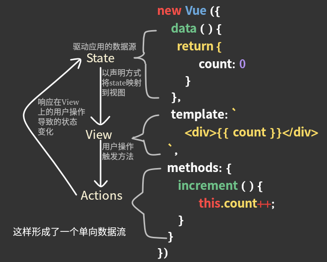

# Vuex

## Vuex 是什么？

Vuex 是一个专门为 Vue 应用开发的**状态管理模式**。它采用集中式存储管理应用的所有组件的状态，并以相应的规则保证状态以一种可预测的方式发生变化。


**什么是“状态管理模式”？**

先看看Vue应用中的单向数据流：



当应用中多个组件共享状态时，单向数据流的简洁性就很容易被破坏，复杂的组件之间状态传递，最终导致代码难以维护。

将组件的共享状态抽取出来，以一个全局的单例模式管理，这种模式下，组件树构成了一个巨大的“View”，这样组件都能获取状态或者触发行为。
通过定义和隔离状态管理中的各种概念并通过强制规则维持 View 和 State 间的独立性，代码会变得更结构化且易维护。


**什么情况下应该使用 Vuex ？**

Vuex 更适合用于一个中大型单页应用中。

## 核心概念

### Store

每一个 Vuex 应用的核心就是 store（仓库）。“store”相当于一个容器，它包含着应用中大部分的 state。

Vuex 和单纯的全局对象的区别：

1. Vuex 的状态存储是响应式的，当 Vue 组件从 store 中读取状态的时候，若 store 中的状态发生变化，相应的组件也会响应得到高效更新。
2. 不能直接改变 store 中的 state，改变 store 中的 state 唯一的途径就是显式地`commit` mutation，这样可以方便地跟踪每一个 state 的变化。

创建一个简单的 store：

```javascript
import Vue form 'vue';
import Vuex from 'vuex';
Vue.use(Vuex);
const store = new Vuex.Store({
  state: {
    count: 0
  },
  mutations: {
    increment (state) {
      state.count++;
    }
  }
});

// 然后就可以通过 store.state 获取 state
store.state.count;
// 通过 store.commit 触发状态变更
store.commit('increment');
```

为了在 Vue 组件中可以访问`this.$store`，需要为 Vue 实例提供创建好的 store。

```javascript
new Vue({
  el: '#app',
  store: store
});
```

然后就可以从组件的方法中提交一个变更：

```javascript
methods: {
  increment () {
    this.$store.commit('increment');
  }
}
```

### State

