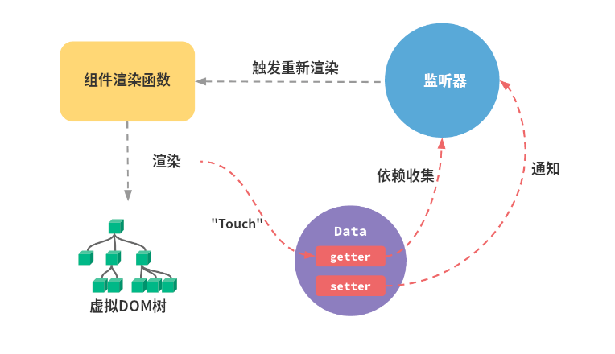

# Vue 响应式详解

## 什么是 Vue 响应式？

> 数据发生变化后，会重新对页面渲染，这就是Vue响应式。



**完成这个过程需要的步骤：**

- 数据劫持 / 数据代理（侦测数据的变化）
- 依赖收集（收集视图依赖了哪些数据）
- 发布订阅模式（数据变化时，自动通知需要更新的视图部分，并进行更新）

---

## 如何侦测数据变化

有2种方法可以侦测到变化：

1. `Object.defineProperty`
2. `Proxy`

### `Object.defineProperty`

> `Object.defineProperty()` 方法会直接在一个对象上定义一个新属性，或者修改一个对象的现有属性，并返回此对象。

Vue 通过设定对象属性的 `getter/setter` 方法来监听数据的变化，通过 `getter` 进行依赖收集，而每个 `setter` 方法就是一个观察者，在数据变更的时候通知订阅者更新视图。

```javascript
function render() {
  console.log('模拟视图渲染');
}
// 侦测数据
function observe(obj) {
  // 判断类型
  if (!obj || typeof obj !== 'object') return;

  Object.keys(obj.forEach(key => {
    defineReactive(obj, key, obj[key]);
  }));
  
  function defineReactive(obj, key, value) {
    observe(value); // 递归子属性
    Object.defineProperty(obj, key, {
      enumerable: true, // 可枚举
      configurable: true, // 可配置
      get: function reactiveGetter() { // 获取对象属性会触发get
        return value;
      },
      set: function reactiveSetter(newVal) { // 改变对象的值会触发set
        observe(newVal); // 若新值是一个对象，也要递归子属性
        if (newVal !== value) {
          render(); // 值更新后，触发重新渲染
          value = newVal;
        }
      }
    })
  }
}

// 设置初始值
let data = {
  name: '更新数据',
  location: {
  	x: 100,
		y: 100
	}
}
observe(data);
```

**侦测 Vue 中 data 的数据：**

```javascript
class Vue {
  constructor (options) {
    this.__data = options.data;
    observer(this._data);
  }
}
```

这样只要 new 一个 Vue 对象，就会将 data 中的数据进行追踪变化。
**但是上述代码无法检测到对象属性的增加或删除**。
以为 Vue 通过 `Object.defineProperty()` 将对象的 key 转换成 `getter/setter` 形式来追踪变化，但 `setter/getter` 只能追踪一个数据*是否被修改*，无法追踪*新增和删除*属性。如果是删除属性，可以用`vm.$delete` 实现，如果是新增属性怎么办？

1. 可以使用 `Vue.set()` 方法向嵌套对象添加响应式属性；
2. 也可以给这个对象重新赋值（`data.location = { ...data.location, a: 1 }`）。

`Object.defineProperty()` 不能监听数组的变化，需要进行数组方法的重写。


### `Proxy`

`Proxy` 是 JavaScript 2015 的新特性。

> `Proxy` 用于修改某些操作的默认行为，可以理解为，在目标对象之前架设一层“拦截”，外界对该对象的访问都必须先通过这层拦截，因此提供了一种机制，可以对外界的访问进行过滤和改写。

Proxy 的代理是针对*整个对象*，而不是对象的某个属性，因此 `Proxy` 只需要做一层代理就可以监听*同级结构*下的所有属性变化，当然对于*深层结构*，还是要进行递归的。此外， `Proxy` 支持代理数组的变化。

**模拟代码：**

```javascript
function render() {
  console.log('模拟视图更新');
}
let handler = {
  get (target, key) {
    // 如果值是对象，就再对这个对象进行数据劫持
    if (typeof target[key] === 'object' && target[key] !== null) {
      return new Proxy(target[key], handler);
    }
    return Reflect.get(target, key);
  },
  set (target, key, value) {
    if (key === 'length') return true;
    render();
    return Reflect.set(target, key, value);
  }
}

let obj = {
  name: '前端工匠',
  age: { age: 100 },
  arr: [1, 2, 3]
};

let proxy = new Proxy(obj, handler);
proxy.age.name = '浪里行舟'; // 支持新增属性
console.log(proxy.age.name);
proxy.arr[0] = '浪里行舟'; // 支持数组的内容变化
console.log(proxy.arr);
proxy.arr.length--; // 无效
```

**`Proxy` 和 `Object.defineProperty()` 的区别：**

| `Object.defineProperty`                    | `Proxy`                                              |
| ------------------------------------------ | ---------------------------------------------------- |
| 必须遍历对象的每个属性                     | 只需做一层代理，就可以监听*同级结构*下的所有属性变化 |
| 不能监听数组的变化，需要进行数组方法的重写 | 支持代理数组的变化                                   |
| 规范：ES 5.1                               | 规范：ES 2015<br />兼容性不大好                      |

---

## 依赖收集

**为什么要收集依赖？**

为了在数据发生变化时，可以通知那些曾经使用该数据的视图部分，而不用刷新整个视图。

### 订阅者 Dep

为了存储依赖因此创建了 Dep，用来*收集依赖*、*删除依赖*、*向依赖发送消息*等。

**Dep的简单实现：**

```javascript
class Dep {
  constructor () {
    // 用来存放Watcher对象的数组
    this.subs = [];
  }
  addSub (sub) {
    // 可以在目前的Dep对象中增加一个Watcher的订阅操作
    this.subs.push(sub);
  }
  /* 通知所有Watcher对象更新视图 */
  notify () {
    this.subs.forEach(sub => {
      sub.update();
    });
  }
}
/* 调用 */
let dp = new Dep();
// 收集依赖
do.addSub(() => {
  console.log('emit here');
});
// 派发更新
dp.notify();
```

---

## 观察者Watcher

**为什么引入Watcher？**

当属性发生变化后，要通知用到数据的地方，而使用这个数据的地方有很多，而且类型还不一样，既有可能是模板，也有可能是用户写的一个watch，这时需要抽象出一个能几种处理这些情况的类。然后，我们在依赖收集阶段只手机这个封装好的类的实例进来，通知也只通知它一个，再由它负责通知其他地方。

**依赖收集的目的是：**将Watcher对象存放到当前闭包中的订阅者Dep的subs中。形成如下所示的这样一个关系。


**Watcher的简单实现**

```javascript
class Watcher {
  constructor (obj, key, cb) {
    // 将Dep指向自己
    Dep.target = this;
    // 触发属性的getter添加监听
    this.cb = cb;
    this.obj = obj;
    this.key = key;
    this.value = obj[key];
    // 将Dep.target置空
    Dep.target = null;
  }
  update () {
    // 获得新值
    this.value = this.obj[this.key];
    // 更新视图
    this.cb(this.value);
  }
}
```

**依赖的本质：**
依赖其实就是 Watcher。

**如何收集依赖：**
在`getter`中收集依赖，在`setter`中触发依赖。先把用到改数据的地方收集起来，然后等属性发生变化时，把之前收集好的依赖循环触发一遍。

当外界通过 Watcher 读取数据时，便会触发`getter`，从而将 Watcher 添加到依赖中，哪个 Watcher 触发了 getter，就把哪个 Watcher 收集到 Dep 中。当数据发生变化时，会循环依赖列表，把所有的 Watcher 都通知一遍。

---

## 总结

**【详细模拟代码】：**

```javascript
const Observer = function(data) {
  console.log(4, 'Observer初始化');
  for (let key in data) { // 循环为每个属性添加getter/setter
    defineReactive(data, key);
  }
}

const defineReactive = function(obj, key) {
  console.log(5, '配置对象属性getter/setter');
  // 局部变量dep，用于get set内部调用
  const dep = new Dep();
  // 获取当前值
  let val = obj[key];
  Object.defineProperty(obj, key, {
    enumerable: true, // 可循环
    configurable: true, // 可配置
    get () {
      console.log(10, 19, '取值');
      // 调用依赖收集器中的addSub，收集当前属性与Watcher中的依赖关系
      dep.depend();
      return val;
    },
    set (newVal) {
      console.log(15, '设置值');
      if (newVal === val) {
        return;
      }
      val = newVal;
      // 当值发生变更时，通知依赖收集器，更新每个需要更新的Watcher
      dep.notify();
    }
  });
}

const observe = function(data) {
  console.log(3, '准备初始化Observer');
  return new Observer(data);
}

const Vue = function(options) {
  console.log(1, 'Vue初始化'); //开始1 new Vue的时候就会执行
  const self = this;
  // 将data赋值给this._data，源码这部分用的Proxy
  if (options && typeof options.data === 'function') {
    console.log(2, '拿到data的值给Vue');
    this._data = options.data.apply(this);
  }
  /* 挂载函数 */
  this.mount = function() {
    console.log(7, 'Vue挂载');  //开始7  new Vue以后，执行vue.mount()
    new Watcher(self, self.render);
  }
  /* 渲染函数 */
  this.render = function() {
    console.log(9, 18, '渲染');
    with(self) {
      _data.text;  //这里取data值的时候，就会触发get()
    }
  }
  // 监听this._data
  observe(this._data);
}

const Watcher = function(vm, fn) {
  console.log(8, '初始化Watcher');
  const self = this;
  this.vm = vm;
  // 将当前Dep.target指向自己
  Dep.target = this;
  // 向Dep方法添加当前Wathcer
  this.addDep = function(dep) {
    console.log(13, '向Dep添加当前Watcher');
    dep.addSub(self);
  }
  // 更新方法，用于触发vm._render
  this.update = function() {
    console.log(17, 'Watcher更新');
    fn();
  }
  // 这里会首次调用vm._render，从而触发text的get
  // 从而将当前的Wathcer与Dep关联起来
  this.value = fn();
  // 这里清空了Dep.target，为了防止notify触发时，不停的绑定Watcher与Dep，
  // 造成代码死循环
  Dep.target = null;
}

const Dep = function() {
  console.log(6, '初始化订阅者');
  const self = this;
  // 收集目标
  this.target = null;
  // 存储收集器中需要通知的Watcher
  this.subs = [];
  // 当有目标时，绑定Dep与Wathcer的关系

  this.depend = function() {
    console.log(11, 20, '准备依赖收集');
    if (Dep.target) {
      console.log(12, '依赖收集');
      Dep.target.addDep(self);
    }
  }
  // 为当前收集器添加Watcher
  this.addSub = function(watcher) {
    console.log(14, '为当前收集器添加Watcher');
    self.subs.push(watcher);
  }
  // 通知收集器中所的所有Wathcer，调用其update方法
  this.notify = function() {
    console.log(16, '通知所有Watcher更新');
    for (let i = 0; i < self.subs.length; i += 1) {
      self.subs[i].update();
    }
  }
}

const vue = new Vue({
  data() {
    return {
      text: 'hello world'
    };
  }
});

vue.mount(); // in get
vue._data.text = '123'; // in watcher update /n in get
```

**【解析】：**

1. 一开始`new Vue`执行构造函数。
2. Vue 的入参`options.data`是一个函数，将 Vue 中的 data 函数返回的数据赋值给 _data。
3. 初始化一个 Observer 的实例。
4. Observer 给 data 数据都加上 get 和 set 方法。
5. 然后走到第9行，执行defineReactive，打印2,然后15行给每个`属性`加上`get和set`方法。
6. new Dep的时候执行Dep。Dep函数剩下的代码都只是定义函数，都不会执行，会跳出Dep函数。回到defineReactive函数继续执行，defineReactive剩下的代码中的函数也不会执行，所以会回到Observer，`new Vue的过程走完了`。
7. `vue.mount()`，执行挂载。
8. `new Watcher`，然后**「Dep.target = this」**，这一步将watch实例挂载到了Dep的target属性上，从而关联起来。
9. Watcher 中的 fn() 实际是Vue传进来的**render()**，后面又加了`()`就会立即执行，因此执行 render 函数，读取 _data.text ，这一步就会触发get方法（这一步的目的就只是为了触发get，所以获取值就行了，并不需要做其他操作）。
10. 执行 get。
11. 执行dep.depend() 准备依赖收集。
12. 判断Dep.target，由于第8步将watch挂载到了Dep.target，这时候为true，执行 Watcher 的 addDep。
13. 向Dep方法添加当前 Wathcer，执行 Dep 的 addSub。
14. 依赖收集，然后回到Watch，执行最后一行，`Dep.target = null`，避免陷入死循环，然后Watch执行完了，**「vue.mount()也执行完了」**。
15. 赋值操作，触发set。
16. 执行 dep.notify()，通知依赖收集器更新每个需要更新的Watcher。
17. 执行Watcher的update。
18. 执行render函数。
19. render 函数会执行取值操作，触发get。
20. get 函数会调用依赖收集器的 depend 准备依赖收集，由于此时 Dep.target为null，判断条件内的代码不会执行。