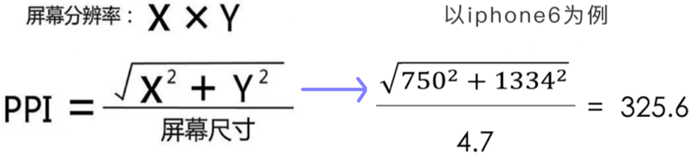

# WXSS

# 1. 选择器

目前支持的选择器：

| 选择器             | 描述                                              |
| ------------------ | ------------------------------------------------- |
| `.class`           | class 选择器                                      |
| `#id`              | ID 选择器                                         |
| `element`          | 元素选择器                                        |
| `element, element` | 多元素选择                                        |
| `::after`          | 后伪类                                            |
| `::before`         | 前伪类                                            |
| `nth-type-of(n)`   | 匹配属于父元素的特定类型的第 N 个子元素的每个元素 |

优先级：

1. `!important` => +∞；
2. `style`标签内联样式 => 1000；
3. `#id` => 100；
4. `.class` => 10；
5. `element` => 1。

# 2. 尺寸单位

`rpx` 是响应式单位。因为微信小程序不能识别`rem`等像素单位。规定屏幕宽为`750rpx`（如 iPhone6 上，屏幕宽度为 375px，`750rpx = 375px` => `1rpx = 0.5px`）。

**设备像素：**设备能控制的屏幕显示的最小物理单位，这些物理单位是显示屏幕上的一个个点，这些点是固定的。

**CSS 像素：**Web 编程中的逻辑像素。

**PPI / DPI：**每英寸拥有的像素数，数值越高代表显示屏能以越高的密度显示图像。

**DPR：**手机的某一方向上设备像素和CSS像素之比，在微信开发者工具里模拟器上方切换不同设备时就能看到对应的DPR数值。



# 3. 外联样式导入

使用`@import`标识符来导入外联样式，命令后跟要导入的外联样式表的相对路径，用`;`表示语句结束。

```css
@import './index.wxss';
.container {
  /* style... */
}
```

而静态样式统一写到`class`中，`style`内联接收动态样式，避免将静态样式写到`style`属性中，以避免影响渲染速度。